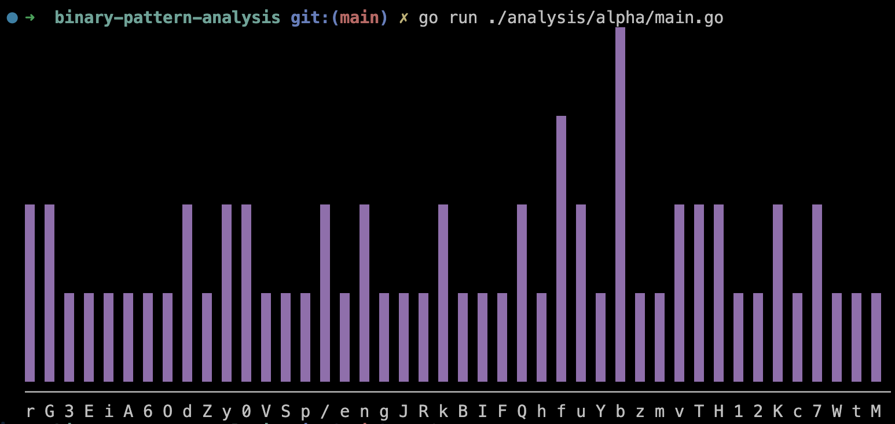

# Ciphertext Alpha

This is the shortest of them all at just 64 characters. It is a base64 string with 44 unique characters. A sufficiently long English text encoded to base64 would present 59 unique characters, but the base64 would be much longer than 64 total characters.

## First Order Analysis

This analysis is done on the ciphertext as-is, no decoding. It is naive, but worth checking out.

### Frequency Analysis: Monograms

I implemented a basic frequency analysis tool in `tools/analysis/frequency.go` which creates a frequency map. this map is then passed through the visualizer in `tools/utils/map.go`. It produces the below chart:

This is an analysis of individual characters in the base64 string. The most common character is `b`, the scond most common is `f`, and the rest only appear 0, 1, or 2 times.